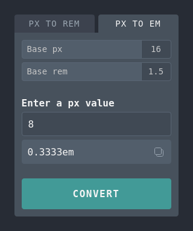

# Simple rem/em Converter

**A simple and lightweight online tool to convert px to either rem or em.**

Probably the fastest way to convert px to rem is directly in your editor, using an appropriate plugin. However, it can be a little more difficult to convert a px value to the correct em value if the corresponding font size is not set to something that is easy to calculate, such as 1rem.

This is where this converter comes in handy, as it allows you to enter a base value for rem. It also has an option to show or hide leading zeros in the result, as well as a copy-to-clipboard button that copies the result along with the unit, ready to paste into your stylesheet.

## Try it out

To use the converter, visit the [Simple rem/em Converter](https://dusan-b.github.io/simple-rem-em-converter) website.

## Usage

### Convert px to em

Let's say you have a font size in rem and a padding in px in your stylesheet.

```css
.example {
  font-size: 1.5rem;
  padding: 12px;
}
```

1. Change to the 'px to em' tab.
2. Enter the value of `font-size` (1.5) in the 'base rem' field.
3. Enter the value of `padding` (12) in the main field.
4. Click the 'convert' button or simply press enter on your keyboard.
5. Copy the result and replace the value of `padding` in your stylesheet.



---

**License**<br>
This project is licensed under the terms of the MIT license.
