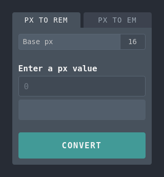

# Simple rem/em Converter

A simple and lightweight online tool for converting px either to rem or em.



---

## Usage

### Convert px to rem

1. Enter a base px value (optional). The default value is `16px`.
2. Enter a px value which you want to convert to rem.
3. Click on the 'Convert' button or just hit enter to show the result.
3. You can copy the result by clicking on the copy icon.

### Convert px to em

The same as above with the additional option to define a base rem value. The default value is `1rem`.

**Example:**

Let's say you specified in your stylesheet a `font-size` in `rem`, and `padding` in `px`.

```css
.example {
  font-size: 1.5rem;
  padding: 12px;
}
```

To convert the px value to em:

1. Enter the number value of `font-size` (in this case 1.5) in the 'Base rem' field.
2. Enter the number value of `padding` (in this case 12) in the main field.
3. Click on the 'Convert' button and copy the result.
4. Replace the value of `padding`.


## Try it out

To use the converter, visit the [Simple rem/em Converter](https://dusan-b.github.io/simple-rem-em-converter) website.

---

## License

This project is licensed under the terms of the MIT license.
