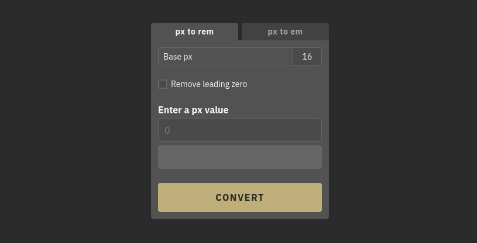

# Simple rem/em Converter

## Description

A simple and lightweight online tool to convert px to either rem or em. It offers the ability to show or hide leading zeros in the result, as well as a copy-to-clipboard button that copies the result along with the unit, ready to paste directly into your stylesheet.

To use the converter, visit the [Simple rem/em Converter](https://pxtorem.dbran.cc) website.

## Bugs & Support
If you find an issue, please feel free to [report it](https://github.com/dusan-b/simple-rem-em-converter/issues).

## License

This project is licensed under the terms of the MIT license.
